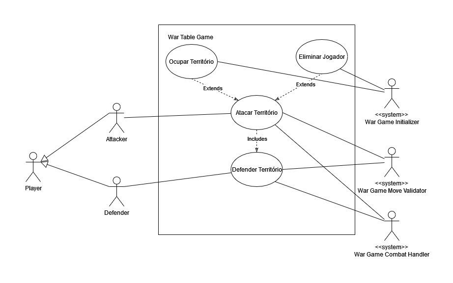

# Especificação de Caso de Uso: Fase de Ataque Entre Territórios

## Caso de Uso: Atacar Território

### Descrição:
Durante a fase de ataque de uma jogada, um jogador pode realizar ataques a territórios de outros jogadores conectados aos seus territórios possuídos a quantidade de vezes desejada.

## Interesses e Interessados:
- **Jogador**: deseja conquistar territórios para alcançar o objetivo(s) que lhe foi atribuído.
- **Validador de Jogada**: Quer garantir que as as ações realizadas durante um ataque entre territórios são computadas e da prosseguimento as fases de uma jogada. Deseja analisar a conclusão de objetivos por meio da ocupação de territórios e eliminação de jogadores. 
- **Inicializador do Jogo**: Quer garantir que todos os jogadores tenham sido atribuídos com objetivos e tenham recebido territórios para poder iniciar uma fase de ataque entre territórios. Deseja garantir que um jogo foi concluído com a vitória de um dos jogadores para assim poder realizar a inicialização de um novo jogo.
- **Administrador de Combates**: Deseja emitir resultados de empates, vitórias e derrotas durante um ataque entre territórios. Quer garantir que os resultados obtidos sejam devidamente aplicados nos territórios dos jogadores.

## Pré-condições:
- Todos os jogadores possuem territórios ocupados com pelo menos um exército
- Todos os jogadores foram atribuídos com objetivo(s)
- O jogador realizou a fortificação de um território

## Fluxo de Eventos:
### Fluxo Básico:
1. Jogador anuncia território atacante
2. Validador de Jogada verifica que jogador possui o território
3. Validador de Jogada verifica que território possui mais de um exército
4. Jogador anuncia qual território será alvo do ataque
5. Validador de Jogada verifica que território é ligado pela fronteira do território atacante
6. Administrador de combates seleciona quantidade máxima possível de exércitos para realizar o ataque
7. Administrador de combates seleciona quantidade máxima possível de exércitos para defender território alvo
8. Administrador de combates emite valores aleatórios para a quantidade de exércitos atacantes
9. Administrador de combates emite valores aleatórios para a quantidade de exércitos defensores
10. Administrador de combates seleciona o menor número de exércitos para realizar comparações com os maiores números obtidos
11. Administrador de combates calcula quantidade de vitórias e derrotas 
12. Administrador de combates realiza a remoção de exércitos entre os territórios de ataque e defesa de acordo com o número de vitórias e derrotas obtidos
13. Jogador repete passos 1 ao 4 ou anuncia término de combate 
14. Validador de jogada encerra fase de ataque

### Fluxo Alternativo:
1. 
    a: Jogador não possui território anunciado
    1. Sistema anuncia que jogador não possui território selecionado
    1. Jogador seleciona território possuido

    b: Jogador não possui mais de um exército em seu território selecionado:
    1. Sistema anuncia que território possui quantidade de exércitos insuficientes para realizar o ataque
    1. Jogador seleciona um de seus territórios com mais de um exército para realizar ataque
    
    c: Jogador anuncia término do combate
    1. Validador de jogada encerra fase de ataque
    1. Validador de jogada inicia próxima fase da rodada

4. a: Jogador seleciona território que não está conectado a território de ataque:
    1. Sistema anuncia que território alvo não está conectado ao território de ataque
    1. Jogador seleciona território alvo conectado ao território de ataque
12. a: Validador de jogadas identifica que território alvo não possui exércitos
    1. Validador de jogadas inicia fase de povoamento de território recentemente conquistado
    1. Validador de jogadas retoma fase de ataque 

## Pós Condições:
- O número de territórios dos jogadores foram atualizados
- O número de exércitos dos jogadores foram atualizados
- A próxima fase da jogada foi iniciada

## Regras de Negócio específicas:

- RNE001: O jogador não pode atacar um território não contiguo ou não conectado por fronteiras;
- RNE002: O jogador não pode atacar um território se o território atacante possuir apenas um exército;
- RNE003: O jogador pode utilizar no máximo três exércitos por ataque;
- RNE004: O jogador não pode atacar o prórprio território;
- RNE005: O jogador pode atacar a quantidade de vezes desejada durante uma rodada;
- RNE006: Caso ocorra um empate durante uma Batalha, a vitória é do lado defensor;
- RNE007: O jogador só pode realizar um ataque a partir da segunda rodada.

## Diagrama de Caso de Uso: Fase de ataque entre territórios

